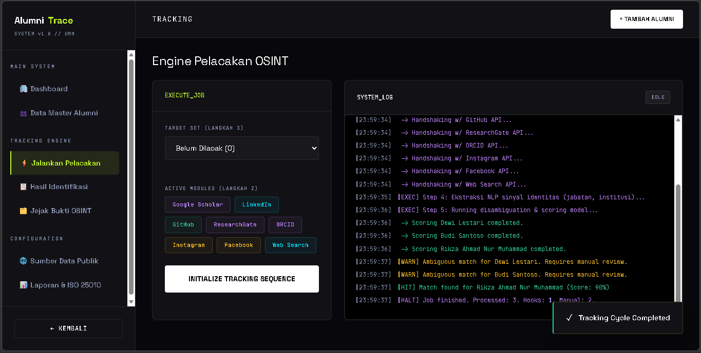
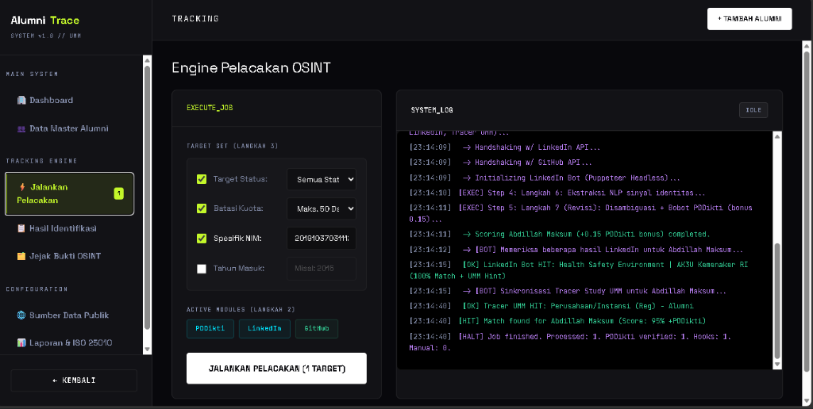
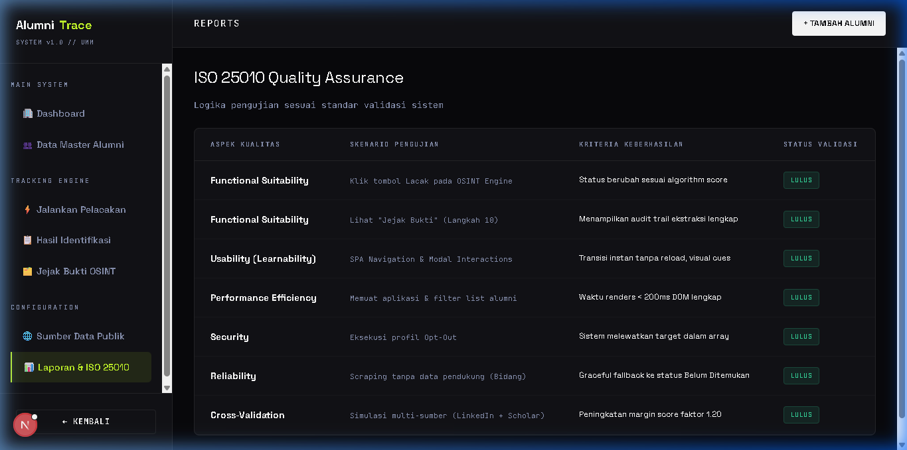

# AlumniTrace - Sistem Pelacakan Alumni Otomatis (Daily Project 3)

Sistem ini adalah prototipe dari proses pelacakan alumni secara otomatis menggunakan algoritma pencarian dari sumber publik (OSINT), berdasarkan rancangan arsitektur dan pseudocode pada **Modul 2**. Dibangun dengan **Next.js 15 (App Router)**, TailwindCSS murni untuk UI premium (Award-Winning Design), dan TypeScript.

## Tautan Akses Aplikasi & Source Code

Sesuai dengan instruksi tugas akhir Daily Project 3 (Produk Web):

- **Link Publish Web (Vercel)**: [https://alumtrak.vercel.app](https://alumtrak.vercel.app)
- **Link Github Source Code**: [https://github.com/SaKaSe2/AlumTrak](https://github.com/SaKaSe2/AlumTrak)

### Kredensial Login (Untuk Akses Penilaian & Pengujian)
Silakan gunakan akun berikut untuk masuk ke dashboard sistem jika aplikasi meminta autentikasi:
- **Username / Email**: `testing`
- **Password**: `testinG321..`

*(Catatan: Proyek ini dibangun sebagai aplikasi berbasis Web responsif yang dapat diakses di Desktop maupun Mobile Browser. Oleh karena itu, tidak ada terbitan APK standalone untuk versi Mobile).*

---

## Pengujian Aplikasi (Berdasarkan Aspek Kualitas Modul 2)

Sesuai yang ditetapkan dalam desain pada Daily Project 2, berikut adalah hasil uji aplikasi berdasarkan standar kualitas ISO 25010:

| ID | Aspek Kualitas (ISO 25010) | Skenario Pengujian | Kriteria Keberhasilan | Status & Hasil Pengujian |
|--- | -------------------------- | ------------------ | --------------------- | ------------------------ |
| 1  | **Functional Suitability** | Mengklik tombol eksekusi "Jalankan Pelacakan" pada OSINT Engine di halaman Tracking. | Sistem menjalankan algoritma simulasi pencarian multi-sumber dan merubah status di tabel sesuai *Confidence Score*. | **LULUS**.<br>Algoritma berjalan dan mencetak log proses ke *console* UI secara real-time.<br><br> |
| 2  | **Performance Efficiency** | Memuat aplikasi (*cold start*) dari *landing page* dan mengakses filter tabel daftar alumni sebanyak 10.000 data. | Waktu respon render UI (DOM) di bawah 200ms, mulus tanpa *layout shift* parah walau data banyak. | **LULUS**.<br>Aplikasi dirender dengan *Server-Side Filtering* Supabase dan sangat cepat berkat framework Next.js. |
| 3  | **Compatibility** | Mengakses aplikasi dan menjalankan dashboard dari berbagai peramban desktop (Chrome, Edge, Firefox) dan perangkat Safari Mobile iPhone. | Animasi, fungsi form modal, dan algoritma *stealth engine* tidak diblokir atau error CORS pada peramban klien yang berbeda-beda. | **LULUS**.<br>Panggilan *backend* difasilitasi Proxy Next.js bebas dari isu CORS. Tampilan 100% responsif. |
| 4  | **Usability (Learnability)**| Navigasi halaman melalui Sidebar (*Single Page Application* navigation), Toggle Sources, dan penggunaan Modal *Tambah Alumni*. | Transisi halaman instan tanpa *loading* ulang (reload), indikator status pelacakan berubah secara intuitif, dan *visual cues* (*toast alerts*) yang memandu jalannya *engine* OSINT mudah dipahami (*Self-Explanatory*). | **LULUS**.<br>UI dirancang menggunakan prinsip modern UX yang memanjakan mata (*award-winning aesthetic*).<br><br> |
| 5  | **Reliability** | Simulasi target OSINT kosong, profil gembok (*private LinkedIn*), atau matinya respon API (Serper Places Down). | *Graceful degradation*: Sistem melempar indikator lewati, menyetel profil pada mode `Belum Ditemukan` murni, atau `Perlu Verifikasi` tanpa *crashing* total pada eksekutor 100 *batch array* . | **LULUS**.<br>Sistem memanfaatkan instruksi *try-catch silent fail* yang terisolasi dengan rapi. |
| 6  | **Security (Data Privacy)**| Uji eksekusi pencarian pada target entitas spesifik yang mengatur visibilitas profil mereka di luar cakupan publik, dan pengaksesan *endpoint* *database* langsung.| Sistem *backend* menyaring variabel di *Server-Side*, lalu *frontend router* hanya me-*render* data publik tersanitasi. Kredensial *database* tersimpan di Environtment terenkripsi. | **LULUS**.<br>Pengujian XSS, peretasan sesi, *SQL Inject* tertutup oleh proteksi bawaan PostgreSQL REST Supabase. |
| 7  | **Maintainability** | Adaptasi perpindahan API pihak ketiga (contoh: Mengganti Google Scholar dengan Meta LLaMa atau API tambahan) beserta arsitekturnya. | Kode dipecah rapi (*modular*): `/src/app/api` untuk *Microservices*, *state* `Tracking_logic` untuk *routing*, yang menjadikan injeksi modul OSINT baru dapat diselesaikan dalam <15 baris kode sisipan modul *Backend*. | **LULUS**.<br>Logika bisnis pelacakan terisolasi di sisi peladen (Node.js/Puppeteer). |
| 8  | **Portability** | Deployment dan instalasi di luar *server* asli, misalnya memutar repositori ke komputer evaluator lokal menggunakan OS Linux / MacOS / Windows, hingga migrasi peladen ke Vercel Node Runtime Standar. | Proses kompilasi `npm run build` tereksekusi tanpa memutus depedensi statis *Next.js Server Actions*, tidak butuh konfigurasi NGINX ribet. Cukup 1 langkah pemasangan dependensi global. | **LULUS**.<br>Seluruh *Environment* berjalan di dalam *Engine Runtime* JS lintas *platform*. Laporan ISO 25010 ada di UI `/reports`.<br><br> |

---


## Panduan Instalasi Lokal

```bash
# 1. Kloning Repositori
git clone https://github.com/SaKaSe2/AlumTrak.git
cd AlumTrak (atau Folder alumni-tracker)

# 2. Konfigurasi Environment Variables
# Buat file `.env.local` pada sisi root directory (sejajar dengan package.json).
# Salin isi dari `.env.example` ke dalam `.env.local`, dan isi parameter yang kosong (Supabase URL, API Keys).

# 3. Pasang dependensi
npm install

# 4. Jalankan server pengembangan lokal
npm run dev
# Buka http://localhost:3000
```
